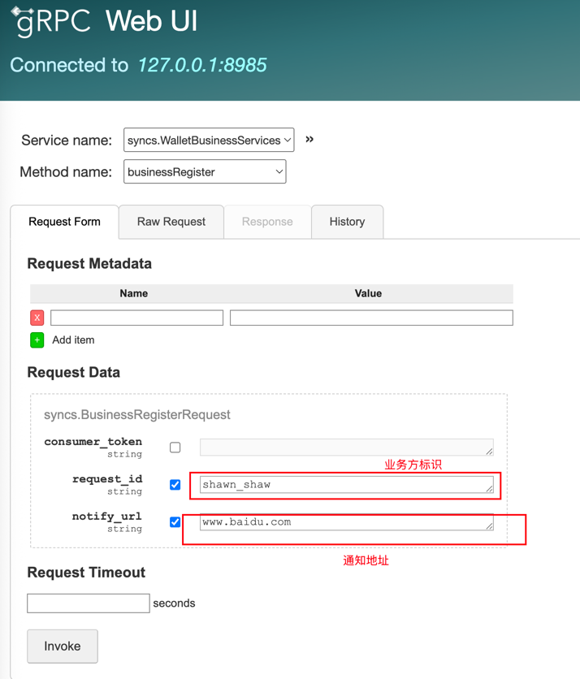
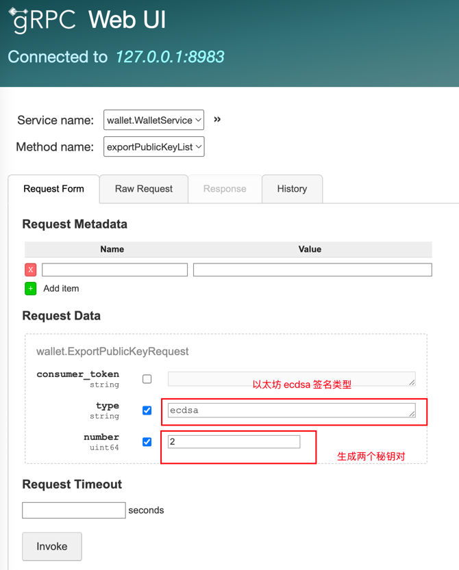
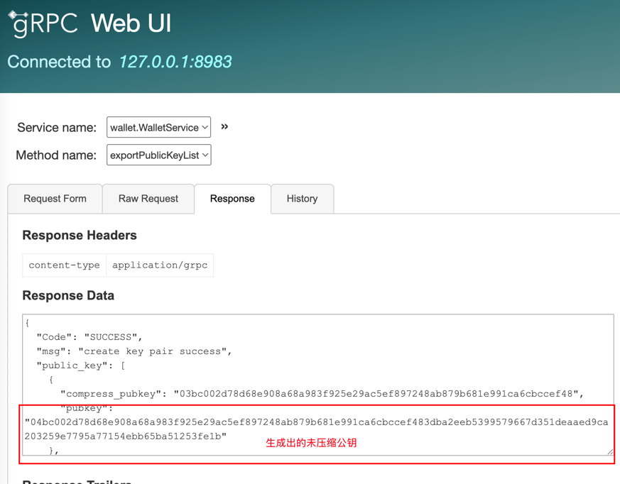
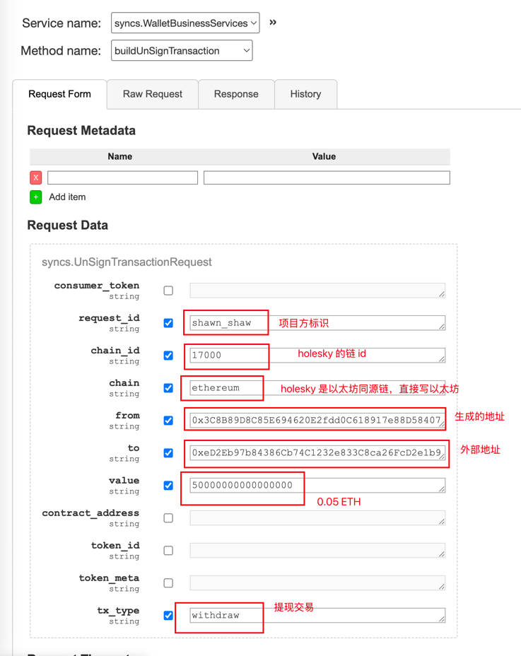
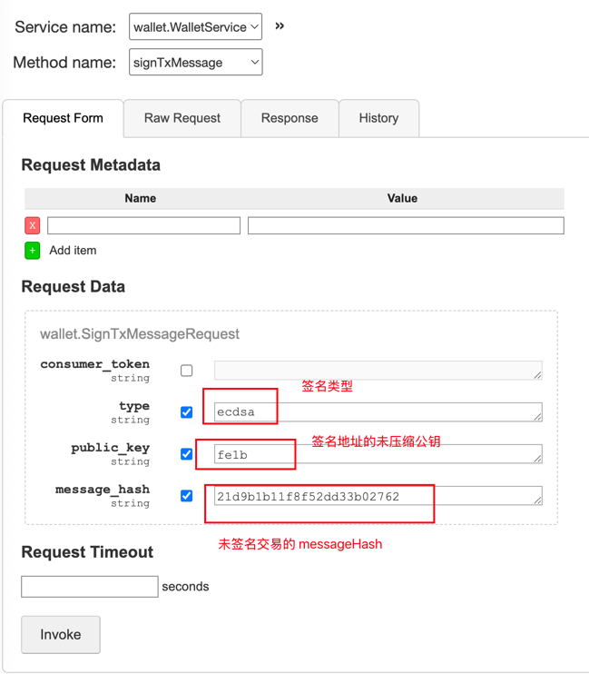
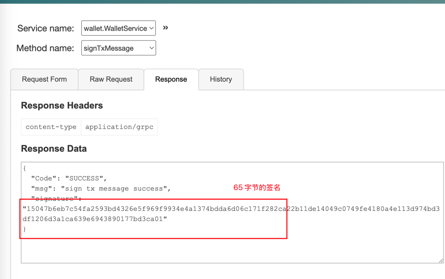
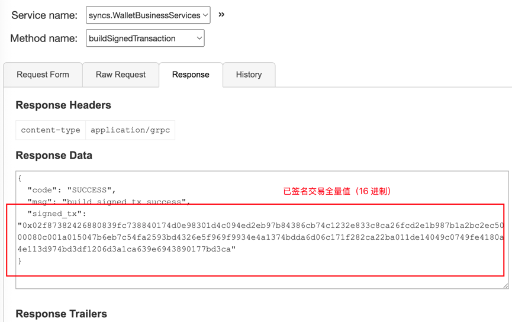
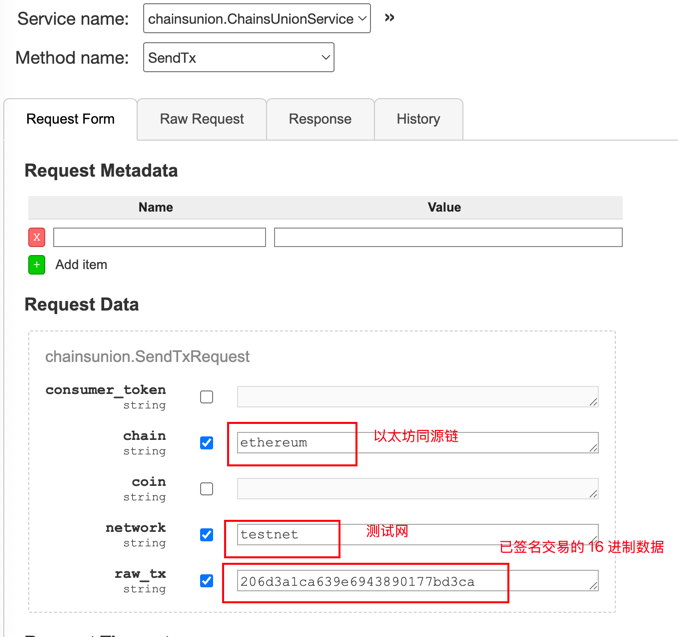

## 1. 项目搭建
- 新建项目 `exchange-wallet-service`
- 目录如下：
```
├── cmd                 主程序入口、命令行程序框架
├── common              通用工具库
├── config              配置文件管理代码
├── database            数据库代码
├── flags               环境变量管理代码
├── migrations          数据库迁移
├── notifier            回调通知管理
├── protobuf            grpc 接口及生成代码
├── rpcclient           grpc 连接客户端
├── services            grpc 服务管理及接口实现
├── sh                  shell 命令
├── worker              核心工作代码（充值、提现、归集、热转冷）
├── exchange.go         主程序生命周期管理
├── Makefile  shell     命令管理
├── devops.md           开发步骤
├── go.mod              依赖管理
├── README.md         
  ```
## 2. 控制台应用整合
- `main.go`
```
func main() {
	log.SetDefault(log.NewLogger(log.NewTerminalHandlerWithLevel(os.Stdout, log.LevelInfo, true)))
	app := NewCli(GitCommit, GitData)
	ctx := opio.WithInterruptBlocker(context.Background())
	if err := app.RunContext(ctx, os.Args); err != nil {
		log.Error("Application failed")
		os.Exit(1)
	}
}
```
- `cli.go`
```
func NewCli(GitCommit string, GitData string) *cli.App {
	//flags := flags2.Flags
	return &cli.App{
		Version:              params.VersionWithCommit(GitCommit, GitData),
		Description:          "An exchange wallet scanner services with rpc and rest api server",
		EnableBashCompletion: true,
		Commands: []*cli.Command{
			{
				Name:        "version",
				Description: "Show project version",
				Action: func(ctx *cli.Context) error {
					cli.ShowVersion(ctx)
					return nil
				},
			},
		},
	}
}
```

## 3. 数据库设计、gorm 搭建
- `Business(businessId,notifyUrl...)`: 注册商户表
- `Blocks(hash,parentHash,number...)`: 区块信息表
- `ReorgBlocks(hash,parentHash,number)`: 回滚区块表（回滚时处理交易使用）
- `Address(address,addressType,publicKey...)`: 钱包地址表
- `Balance(address,tokenAddress,balance,lockBalance...)`: 地址余额表
- `Deposit(from,to,amount,confirms,blockHash...)`: 充值表
- `Withdraw(from,to,amount,blockHash...)`: 提现表
- `Internals(from,to,amount,blockHash...)`: 内部交易表（热转冷、冷转热）
- `Transactions(from,to,amount,fee,hash...)`: 交易流水表
- `Token(tokenAddress,decimals,collectAmount...)`: token合约表

- 数据库迁移脚本：`migrations` 文件夹中 
- 执行数据库迁移：执行 `make` 编译程序，然后 `./exchange-wallet-service migrate`
- 实现每一个表对应结构体、新增表、增删改查接口
## 4. rpc 搭建
- 编写 `exchange-wallet.proto`文件，定义消息和接口
- `make protogo` 生成对应的 protobuf 代码
- 搭建对接 `chains-union-rpc` 的 `client`(需先把`chains-union-rpc` 的 `protobuf` 代码复制过来)
- 搭建 `services`，新建包含 `db、rpcclient`、的 `grpc`，对接进 `urfave/cli` 的程序里，启动 `grpc` 服务
- 编写捕获 `panic` 的拦截器，传入给 grpc 处理
- 此程序提供的接口写在 `handler.go`

## 5. rpc 接口实现
- **业务方注册**：
    1. 业务方携带自己的 `requestId` 进行注册，系统会根据 `requestId` 为其生成独立的 `address`、`balance`、`transactions`、`deposits`、`withdraw`、`internal`、`tokens` 表
    2. 注册成功后，其所有业务都需要携带 `requestId` 进行请求，数据独立在其自己的表中。
    ```
  	BusinessRegister(context.Context, *BusinessRegisterRequest) (*BusinessRegisterResponse, error)
   ```
- **批量导出地址**：
    1. 业务方通过 “`signature-machine`” 项目（项目方自己部署，自己掌控私钥和签名流程）批量生成公钥，将公钥传入此接口，批量获取地址。
    2. 此接口中，会根据用户方传入的地址类型，保存该地址信息到 `address_{requestId}` 表中,并初始化 `balances`
    ```
  	ExportAddressesByPublicKeys(context.Context, *ExportAddressesRequest) (*ExportAddressesResponse, error)
  ```
- **构建未签名交易**：
    1. 在此接口中，业务方传入关键参数：`from`、`to`、`amount`、`chainId` 等信息，调用该接口。该接口会调用 “`chains-union-rpc`” 项目去获取地址的 `nonce`、`gasFee` 等。
    2. 然后构建 `EIP-1159` 的交易，调用 “`chains-union-rpc`” 项目去构建交易，返回 `16` 进制的未签名交易 `messageHash`（`32` 字节）、将交易信息保存在表中。返回 `messageHash` 和请求的 `transactionId`
    ```
      BuildUnSignTransaction(context.Context, *UnSignTransactionRequest) (*UnSignTransactionResponse, error)
  ```
- **构建已签名交易**：
    1. 项目方持有上述的未签名交易的 `messageHash`，调用 “`signature-machine`” 使用该交易对应的 `from` 地址私钥进行对此 `messageHash` 签名，返回 `signature` （`65` 字节） 信息
    2. 项目方拿到 `signature`、`transactionId`。 由 `transactionId` 从表中查出这笔交易，然后重新构造出来相同交易。调用 “`chains-union-rpc`” 的构建已签名接口，使用 `signature` 和 原交易信息发起调用 `BuildSignedTransaction`接口。
    3. 在“`chains-union-rpc`”中，会将 `signature` 拆分出 `r、s、v` 值和原交易组合起来，格式化返回一个已签名的交易（`16` 进制，`base64` 编码）
    4. 在拿到这个已签名交易的 `16` 进制数据后，即可调用 “`chains-union-rpc`” 里面的 `sendTx` 接口，将这笔交易公布到 `rpc` 网络中即可
    ```
  	BuildSignedTransaction(context.Context, *SignedTransactionRequest) (*SignedTransactionResponse, error)
  ```
- **设置合约地址**：
     1. 传入 ERC20 合约地址，作为合约项目白名单，存 tokens_{requestId} 表, 后续接入代币处理用。
    ```
  	SetTokenAddress(context.Context, *SetTokenAddressRequest) (*SetTokenAddressResponse, error)
  ```
- **联调** `exchange-wallet-service`、`signature-machine`、 `chains-union-rpc` **三个项目**
  1. exchange-wallet-service 业务方注册
  
  
  

  2. signature-machine 批量公钥生成

  
  

  3. exchange-wallet-service 公钥转地址

  
  

  4. 转资金进这个地址

  

  5. exchange-wallet-service 构建未签名交易
  
  
  

  6. signature-machine 中签名操作
  
  
  

  7. exchange-wallet-service 构建已签名交易
  
  
  

  8. chains-union-rpc 发送出去交易
  
  
  

  9. holesky 区块浏览器中查看这笔交易
  
  

## 6. 扫链同步器搭建

## 7. 充值业务实现

## 8. 提现业务实现

## 9. 归集业务实现

## 10. 热转冷、冷转热业务实现

## 11. 通知业务实现

